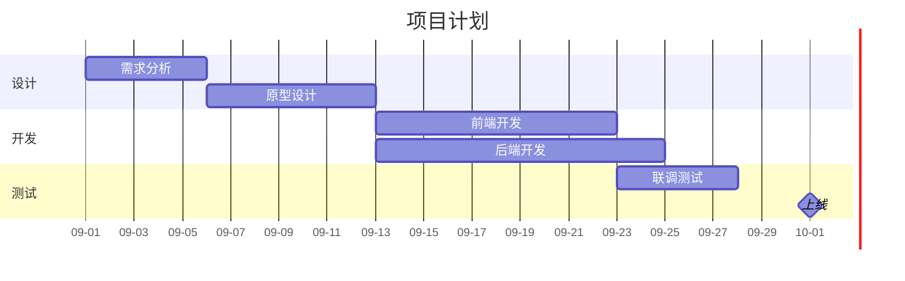

# meng-lanbo.github.io
[toc]
## 1.获取SSH
```
apt install openssh -y
echo -e "password\npassword" | passwd
```
## 2.备份
```
mkdir -p /tmp/mybackup/
dd if=/dev/mtd9 of=/tmp/mybackup/mtd9
```

## 3.恢复


```mermaid
gantt
    title 项目计划
    dateFormat  YYYY-MM-DD
    axisFormat  %m-%d

    section 设计
    需求分析 :a1, 2026-09-01, 5d
    原型设计 :a2, after a1, 7d

    section 开发
    前端开发 :b1, 2026-09-13, 10d
    后端开发 :b2, 2026-09-13, 12d

    section 测试
    联调测试 :c1, after b1, 5d
    上线 :milestone, m1, 2026-10-01, 0d
```